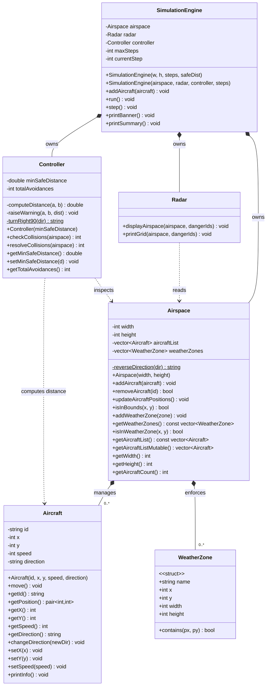

# Air Traffic Control Simulator

A **C++ Object-Oriented** console-based simulation that models an air traffic control system. Aircraft move across a 2D airspace grid, a radar displays their positions with **ANSI color-coded** output, a controller detects and **automatically avoids** potential collisions, and restricted weather zones force aircraft to reroute — all animated in real time.

---

## UML Class Diagram

> **Standalone file:** [`docs/class_diagram.mmd`](docs/class_diagram.mmd) — open in [Mermaid Live Editor](https://mermaid.live) or render with `mmdc -i docs/class_diagram.mmd -o docs/class_diagram.svg`



### Relationship Key
| Symbol | Meaning | Example |
|--------|---------|---------|
| `*--` | **Composition** (owns, lifecycle-bound) | SimulationEngine owns Airspace |
| `..>` | **Dependency** (uses, read-only) | Radar reads Airspace |
| `0..*` | **Multiplicity** (zero-to-many) | Airspace manages 0..* Aircraft |

### OOP Design Patterns Used
- **Composition over Inheritance** — SimulationEngine owns Airspace, Radar, Controller as value members (no raw pointers, no inheritance hierarchies)
- **Single Responsibility Principle** — Each class has exactly one job: Aircraft moves, Airspace manages boundaries + zones, Radar displays, Controller detects, Engine orchestrates
- **Encapsulation** — All data members are `private`; access only through getters/setters
- **Observer Pattern (lightweight)** — Radar and Controller read Airspace state without modifying it (dependency, not composition)
- **Strategy-ready** — Collision detection and avoidance logic are isolated in Controller and Airspace, easily replaceable

---

## Stage 1 — Core Architecture & Simulation Engine

### Features Implemented
- **Aircraft** objects with ID, position (x, y), speed, and 4-direction compass heading
- **Airspace** grid that holds aircraft, updates positions, and enforces boundaries (clamping)
- **Radar** system that displays a formatted status table and an ASCII grid view
- **Controller** that checks every aircraft pair for proximity violations (Euclidean distance)
- **SimulationEngine** that orchestrates the time-step loop: move → detect → display

---

## Stage 2 — Aircraft Class (Full Implementation)

### Changes Made
Refactored the `Aircraft` class to match the clean OOP specification:

### Aircraft Attributes (all private, encapsulated)
| Attribute | Type | Description |
|-----------|------|-------------|
| `id` | `string` | Unique aircraft identifier (e.g. "AA101") |
| `x` | `int` | X position on the airspace grid |
| `y` | `int` | Y position on the airspace grid |
| `speed` | `int` | Units moved per simulation step |
| `direction` | `string` | Compass heading: "N", "S", "E", "W" |

### Aircraft Methods
| Method | Return | Description |
|--------|--------|-------------|
| `Aircraft(id, x, y, speed, direction)` | — | Constructor with full initialisation |
| `move()` | `void` | Updates position based on direction and speed |
| `getId()` | `string` | Returns the aircraft ID |
| `getPosition()` | `pair<int,int>` | Returns (x, y) as a pair |
| `getX()`, `getY()` | `int` | Returns individual coordinates |
| `getSpeed()` | `int` | Returns speed |
| `getDirection()` | `string` | Returns direction string |
| `changeDirection(newDir)` | `void` | Sets new heading with validation |
| `setX()`, `setY()`, `setSpeed()` | `void` | Direct setters for Airspace use |
| `printInfo()` | `void` | Prints formatted aircraft summary |

### Movement Logic
```
N → y += speed   (northward)
S → y -= speed   (southward)
E → x += speed   (eastward)
W → x -= speed   (westward)
```

### OOP Principles Applied
- **Encapsulation** — all attributes are `private`; access only via getters/setters
- **Validation** — `changeDirection()` rejects invalid directions with a warning
- **Clean interface** — `getPosition()` returns a `std::pair` for convenient access
- **Integer grid** — positions and speed are `int` for discrete grid-based movement

### Project Structure
```
AIR TRAFIC CONTROLLER/
├── include/
│   ├── Aircraft.h            # Aircraft class declaration
│   ├── Airspace.h            # Airspace manager declaration
│   ├── AnsiColors.h          # ANSI escape code constants (clr:: namespace)
│   ├── Radar.h               # Radar display declaration
│   ├── Controller.h          # Collision detection & avoidance declaration
│   ├── SimulationEngine.h    # Simulation orchestrator declaration
│   └── WeatherZone.h         # WeatherZone struct
├── src/
│   ├── Aircraft.cpp          # Aircraft implementation
│   ├── Airspace.cpp          # Airspace implementation (weather zone avoidance)
│   ├── Radar.cpp             # Color-coded radar display implementation
│   ├── Controller.cpp        # Collision detection & auto-avoidance
│   ├── SimulationEngine.cpp  # Animated simulation engine with progress bar
│   └── main.cpp              # Entry point with sample aircraft
├── docs/
│   ├── class_diagram.mmd     # UML class diagram (Mermaid)
│   └── INTERVIEW_PREP.md     # Interview preparation guide
├── Makefile                  # Build automation
└── README.md                 # This file
```

### Class Responsibilities

| Class | Responsibility |
|-------|---------------|
| `Aircraft` | Represents a single aircraft with position, speed, direction. Moves itself each step. |
| `Airspace` | Manages the 2D grid, all aircraft, weather zones. Enforces boundaries and zone avoidance. |
| `Radar` | Color-coded observer. Prints ANSI-colored aircraft table and ASCII grid with legend. |
| `Controller` | Safety system. Detects collisions AND auto-reroutes lower-priority aircraft (turn 90°). |
| `SimulationEngine` | Orchestrator. Animated clear-screen loop, progress bar, banner, summary dashboard. |

### Simulation Workflow
```
main()
  └─► SimulationEngine::run()
        ├── Display banner (v2.0, ANSI colored)
        ├── Display initial state
        ├── Wait 2 seconds
        └── FOR each step (1 → maxSteps):
              ├── system("clear")  →  animated screen refresh
              ├── Print progress bar  →  [████████░░░░] 40%
              ├── 1. Airspace::updateAircraftPositions()  →  move + weather zone avoidance + clamp
              ├── 2. Controller::resolveCollisions()  →  detect + auto-reroute (turn 90° right)
              ├── 3. Build danger set  →  IDs of aircraft within safe distance
              ├── 4. Radar::displayAirspace(dangerIds)  →  color-coded status table
              └── 5. Radar::printGrid(dangerIds)  →  color-coded ASCII grid + legend
        └── Print summary dashboard (colored stats)
```

### OOP Concepts Used
- **Encapsulation** — private data with getter/setter access
- **Composition** — SimulationEngine owns Airspace, Radar, Controller
- **Single Responsibility Principle** — each class has one clear job
- **Separation of Concerns** — movement, detection, display are independent

### How to Build & Run

**Prerequisites:** C++17 compatible compiler (g++, clang++)

```bash
# Build
make

# Run
make run

# Clean build artifacts
make clean
```

### Configuration (in main.cpp)
| Parameter | Default | Description |
|-----------|---------|-------------|
| `AIRSPACE_WIDTH` | 40 | Grid width |
| `AIRSPACE_HEIGHT` | 40 | Grid height |
| `MAX_STEPS` | 20 | Simulation duration |
| `SAFE_DISTANCE` | 5.0 | Collision warning threshold |

### Sample Aircraft
| ID | Start Position | Speed | Direction | Notes |
|----|---------------|-------|-----------|-------|
| A1 | (10, 10) | 1 | E | Hits Storm zone → reverses |
| A2 | (20, 10) | 1 | W | Hits Storm zone → reverses |
| A3 | (5, 30) | 1 | N | Hits Fog zone → reverses |
| A4 | (10, 20) | 1 | E | Collision avoidance demo (converges with A5) |
| A5 | (14, 20) | 1 | W | Gets rerouted (lower priority) → turns 90° right |

---

## Stage 3 — Airspace Class (Full Implementation)

### Changes Made
Refactored the `Airspace` class with clean method naming, STL usage, and rich documentation.

### Airspace Attributes (private)
| Attribute | Type | Description |
|-----------|------|-------------|
| `width` | `int` | Grid width (valid x: 0 to width-1) |
| `height` | `int` | Grid height (valid y: 0 to height-1) |
| `aircraftList` | `vector<Aircraft>` | STL vector holding all active aircraft |

### Airspace Methods
| Method | Return | Description |
|--------|--------|-------------|
| `Airspace(width, height)` | — | Constructor, sets grid dimensions |
| `addAircraft(aircraft)` | `void` | Adds aircraft to vector (O(1) amortised) |
| `removeAircraft(id)` | `bool` | Removes by ID using STL remove_if + erase |
| `updateAircraftPositions()` | `void` | Moves all aircraft, clamps to bounds |
| `getAircraftList()` | `const vector&` | Read-only access to aircraft |
| `getAircraftListMutable()` | `vector&` | Mutable access for advanced use |
| `isInBounds(x, y)` | `bool` | Checks if coordinate is inside grid |
| `getWidth()`, `getHeight()` | `int` | Grid dimensions |
| `getAircraftCount()` | `int` | Number of active aircraft |

### Boundary Enforcement
Aircraft that move beyond the grid edges are **clamped** to the boundary:
```
if x < 0       → x = 0
if x >= width  → x = width - 1
if y < 0       → y = 0
if y >= height → y = height - 1
```

### STL Features Used
- `std::vector<Aircraft>` — dynamic aircraft storage
- `std::remove_if` + `erase` — idiomatic removal by predicate
- Lambda capture `[&id]` — for ID matching

---

## Stage 4 — Radar Class (Full Implementation)

### Changes Made
Refactored the `Radar` class with the required `displayAirspace()` method and clean output format.

### Radar Methods
| Method | Return | Description |
|--------|--------|-------------|
| `displayAirspace(airspace)` | `void` | Prints each aircraft ID and position |
| `printGrid(airspace)` | `void` | Renders ASCII grid of the airspace |

### Output Format
```
Aircraft AA101 → (2,3)
Aircraft BB202 → (25,15)
Aircraft CC303 → (10,10)
Aircraft DD404 → (15,5)
Aircraft EE505 → (5,18)
```

### Design Principles
- **Read-only observer** — does not modify aircraft or airspace data
- **Simple interface** — one primary method `displayAirspace()`
- **Clean output** — minimal, scannable `Aircraft <ID> → (<x>,<y>)` format

---

## Stage 5 — Controller Class (Collision Detection)

### Changes Made
Implemented the `Controller` class with Euclidean distance-based collision detection and the required warning format.

### Controller Attributes (private)
| Attribute | Type | Description |
|-----------|------|-------------|
| `minSafeDistance` | `double` | Minimum safe separation (default: 5.0 units) |

### Controller Methods
| Method | Return | Description |
|--------|--------|-------------|
| `Controller(safeDistance)` | — | Constructor, sets safe distance threshold |
| `checkCollisions(airspace)` | `int` | Checks all pairs, returns warning count |
| `getMinSafeDistance()` | `double` | Returns current safe distance |
| `setMinSafeDistance(d)` | `void` | Updates safe distance threshold |
| `computeDistance(a, b)` | `double` | Private — Euclidean distance between two aircraft |
| `raiseWarning(a, b, dist)` | `void` | Private — prints collision warning |

### Collision Rule
Euclidean distance formula:
```
d = sqrt((x2 - x1)^2 + (y2 - y1)^2)

If d < safe_distance → WARNING
```

### Warning Output Format
```
WARNING: Potential collision between Aircraft AA101 and BB202
```

### Algorithm
- Checks all unique pairs: O(n*(n-1)/2)
- Stateless — operates on current airspace snapshot each step
- Configurable threshold via `setMinSafeDistance()`

---

## Stage 6 — SimulationEngine (20-Step Loop with Delay)

### Changes Made
Enhanced the `SimulationEngine` class with full documentation, a **20-step** simulation loop, and a **500 ms** inter-step delay for console readability.

### SimulationEngine Attributes (private)
| Attribute | Type | Description |
|-----------|------|-------------|
| `airspace` | `Airspace` | The 2-D grid holding all active aircraft |
| `radar` | `Radar` | Console display system (read-only observer) |
| `controller` | `Controller` | Collision detection system |
| `maxSteps` | `int` | Total number of simulation steps (default 20) |
| `currentStep` | `int` | 1-based counter tracking the current step |

### SimulationEngine Methods
| Method | Return | Description |
|--------|--------|-------------|
| `SimulationEngine(w, h, steps, safeDist)` | — | Constructor, initialises all subsystems |
| `addAircraft(aircraft)` | `void` | Registers an aircraft before the simulation starts |
| `run()` | `void` | Main entry point — runs the full 20-step loop |
| `step()` | `void` | Executes one step: update → detect → display |
| `printBanner()` | `void` | Prints the welcome banner at simulation start |
| `printSummary()` | `void` | Prints summary statistics at simulation end |

### Simulation Loop (per step)
```
FOR currentStep = 1 TO maxSteps (20):
  1. Airspace::updateAircraftPositions()   → move all aircraft
  2. Controller::checkCollisions()         → Euclidean distance check
  3. Radar::displayAirspace()              → print "Aircraft <ID> → (x,y)"
     Radar::printGrid()                    → render ASCII grid
  ── sleep 500 ms ──
```

### Delay Mechanism
- Uses `std::this_thread::sleep_for(std::chrono::milliseconds(500))`
- Provides a half-second pause between steps so the console output is readable
- Requires `<thread>` and `<chrono>` headers

### Design Principles
- **Composition** — owns Airspace, Radar, Controller (no raw pointers)
- **Orchestrator pattern** — coordinates subsystems without exposing internals
- **Single entry point** — `run()` is the only method main() needs to call
- **Testable** — `step()` is public and can be called independently for unit testing

---

## Weather Zones — Restricted Airspace

### Overview
Rectangular **weather zones** can be placed anywhere in the airspace. Aircraft attempting to enter a zone will have their move **reverted** and their direction **reversed** (N↔S, E↔W), effectively bouncing away.

### WeatherZone Struct (`include/WeatherZone.h`)
| Field | Type | Description |
|-------|------|-------------|
| `name` | `string` | Human-readable label (e.g. "Storm") |
| `x` | `int` | Bottom-left corner X |
| `y` | `int` | Bottom-left corner Y |
| `width` | `int` | Extends rightward from x |
| `height` | `int` | Extends upward from y |
| `contains(px, py)` | `bool` | Returns true if (px, py) is inside the zone |

### Avoidance Logic (in `Airspace::updateAircraftPositions`)
```
for each aircraft:
  1. Save old position (oldX, oldY)
  2. Call move()
  3. If new position is inside a weather zone:
       → Revert to (oldX, oldY)
       → Reverse direction (N↔S, E↔W)
       → Print "[AIRSPACE] Aircraft <ID> reversed — weather zone ahead"
       → Skip boundary clamping
  4. Otherwise clamp to grid boundaries as usual
```

### Radar Display
- Weather zone cells rendered as `#` on the ASCII grid
- Aircraft markers overwrite `#` if they share a cell
- Zone summary printed below the aircraft table

### Demo Zones (in `main.cpp`)
| Name | Position | Size | Purpose |
|------|----------|------|---------|
| Storm | (14, 8) | 5×5 | Blocks A1/A2 on row y=10 — forces reversal |
| Fog | (3, 33) | 4×4 | Blocks A3's northbound path — forces reversal |

### New Airspace Methods
| Method | Return | Description |
|--------|--------|-------------|
| `addWeatherZone(zone)` | `void` | Registers a restricted weather zone |
| `getWeatherZones()` | `const vector&` | Read-only access to all zones |
| `isInWeatherZone(x, y)` | `bool` | Checks if a point is inside any zone |

---

## Automatic Collision Avoidance

### Overview
When two aircraft are on a **collision course** (distance < safe threshold), the Controller automatically **reroutes the lower-priority aircraft** by turning it 90° to the right.

### How It Works
```
for each unique pair (i, j):
  if distance(i, j) < minSafeDistance:
    1. Print ⚠ WARNING (red)
    2. Turn aircraft [j] 90° right  (N→E, E→S, S→W, W→N)
    3. Print [ATC] Rerouting message (yellow)
    4. Increment totalAvoidances counter
```

### New Controller Methods
| Method | Return | Description |
|--------|--------|-------------|
| `resolveCollisions(airspace)` | `int` | Detects AND avoids collisions (active intervention) |
| `getTotalAvoidances()` | `int` | Returns total avoidances across the entire simulation |
| `turnRight90(dir)` | `string` | Static helper — rotates compass heading 90° clockwise |

### Priority Rule
Between aircraft `i` and `j`, the one with the **higher index** (later in the list) is rerouted. This simulates a priority system where earlier-registered aircraft have priority.

### Demo Result
With A4 (10,20,E) and A5 (14,20,W) converging on row y=20:
- Steps 1–8: A4 and A5 approach, A5 is rerouted multiple times
- Final summary reports **Collisions Avoided: 10** across the 20-step simulation

---

## ANSI Color-Coded Console Visualization

### Overview
The entire console output is now **color-coded** using ANSI escape sequences for a professional, readable display.

### Color Scheme
| Color | Meaning | Where Used |
|-------|---------|------------|
| **Green** (bold) | Safe aircraft | Aircraft list `[SAFE]`, grid markers, summary stats |
| **Red** (bold) | Danger — near collision | Aircraft list `[DANGER]`, grid markers, warnings |
| **Yellow** (bold) | Caution — near weather zone | Aircraft list `[CAUTION]`, grid markers, rerouting msgs |
| **Blue** (bold) | Weather zone | Zone info, `#` markers on grid, zone addition msgs |
| **Cyan** (bold) | UI chrome | Borders, progress bar, step counter, banner frame |
| **White** (bold) | Headings | Banner title, summary labels |
| **Dim** | Background elements | Grid dots, borders, totals |

### AnsiColors.h (`clr::` namespace)
```cpp
namespace clr {
    constexpr const char* RESET      = "\033[0m";
    constexpr const char* RED        = "\033[31m";
    constexpr const char* GREEN      = "\033[32m";
    constexpr const char* YELLOW     = "\033[33m";
    constexpr const char* BLUE       = "\033[34m";
    constexpr const char* CYAN       = "\033[36m";
    constexpr const char* WHITE      = "\033[37m";
    constexpr const char* BOLD_RED   = "\033[1;31m";
    // ... full set of bold variants + DIM
}
```

### Animated Features
- **Clear screen** between steps (`system("clear")`) for animation effect
- **Progress bar** showing simulation progress: `Step 5 / 20  [##########------------------------------]  25%`
- **2-second delay** before simulation starts
- **500ms** between steps

### Radar Display Enhancements
- **Aircraft list** — each aircraft shows colored status tag: `[SAFE]`, `[DANGER]`, `[CAUTION]`
- **ASCII grid** — each cell is colored: green=safe aircraft, red=danger, yellow=caution, blue=weather zone, dim=empty
- **Color legend** — printed below the grid: `* Safe  * Danger  * Caution  # Weather Zone`

### Danger Detection (`isNearWeatherZone`)
Aircraft within **2 cells** of any weather zone boundary are tagged `[CAUTION]` (yellow) even before they enter the zone.

### Summary Dashboard
At simulation end, a full-width colored dashboard shows:
- Total Steps Run (cyan)
- Aircraft Tracked (green)
- Weather Zones (blue)
- Collisions Avoided (red if > 0, green if 0)

---
